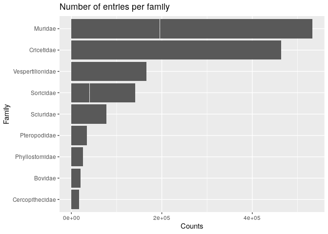
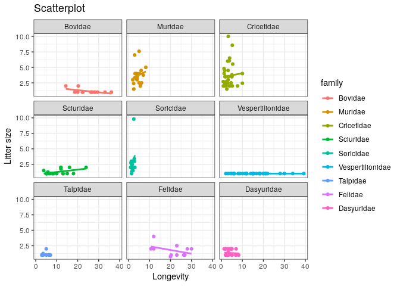

# Introduction

Dans cet exercice nous allons utiliser le package `ggplot2` pour visualiser des données.

# Données

On utilise la base de donnée :

- **PanTHERIA** [:globe_with_meridians:](https://esajournals.onlinelibrary.wiley.com/doi/10.1890/08-1494.1)

La base de données PanTHERIA recense un très grand nombre de traits d'histoire de vie, traits écologiques et géographiques pour les espèces de mammifères du monde entier.
Le fichier texte contenant cette base de données se trouve dans `data/pantheria-traits/PanTHERIA_1-0_WR05_Aug2008.txt`

# Analyses

## Data exploration

### How many observations in family? In order?


```r
dat <- datatoolboxexos::data_pantheria_tidy()
```

```
## 
## ── Column specification ────────────────────────────────────────────────────────
## cols(
##   .default = col_double(),
##   MSW05_Order = col_character(),
##   MSW05_Family = col_character(),
##   MSW05_Genus = col_character(),
##   MSW05_Species = col_character(),
##   MSW05_Binomial = col_character(),
##   References = col_character()
## )
## ℹ Use `spec()` for the full column specifications.
```

We have 153 families and 29 orders, they gather variable number of species :


```r
fams <- dat %>% dplyr::count(family)
```


```r
dat %>% dplyr::count(order)
```

```
## # A tibble: 29 x 2
##    order               n
##    <fct>           <int>
##  1 Artiodactyla      240
##  2 Carnivora         286
##  3 Primates          376
##  4 Didelphimorphia    87
##  5 Cingulata          21
##  6 Rodentia         2277
##  7 Cetacea            84
##  8 Erinaceomorpha     24
##  9 Diprotodontia     143
## 10 Chiroptera       1116
## # … with 19 more rows
```


### What is the mean home range by family? Standard deviation? The sample size?


```r
dat %>%
  dplyr::filter(!is.na(homerange)) %>%
  dplyr::summarise(mean(homerange))
```

```
## # A tibble: 1 x 1
##   `mean(homerange)`
##               <dbl>
## 1              327.
```


```r
dat %>%
  dplyr::filter(!is.na(homerange)) %>%
  dplyr::group_by(family) %>%
  dplyr::summarise(m = mean(homerange), sd = sd(homerange),n = dplyr::n())
```

```
## # A tibble: 93 x 4
##    family               m        sd     n
##    <fct>            <dbl>     <dbl> <int>
##  1 Camelidae    0.13       NA           1
##  2 Canidae     49.6       176.         21
##  3 Bovidae     44.6       159.         24
##  4 Pitheciidae  0.8         1.27        7
##  5 Didelphidae  0.0704      0.160      10
##  6 Dasypodidae  1.38        2.14        4
##  7 Muridae      0.00336     0.00839    35
##  8 Spalacidae   0.0000732  NA           1
##  9 Cricetidae   0.00305     0.00572    62
## 10 Erinaceidae  0.0255      0.0306      4
## # … with 83 more rows
```

## Graph 1: Bar chart of the number of entries per family

- Group by family, and select only those with more than 100 observations.

- Make a bar chart of the number of observations per family. Order the bars by increasing number of observations.

- Add a title and labels to the X and Y axes.


```r
dat %>%
  dplyr::group_by(family) %>% # group by family
  dplyr::mutate(n = dplyr::n()) %>% # calculate number of entries per family
  dplyr::filter(n > 100) %>% # select only the families with more than 100 entries
  ggplot2::ggplot() +
  ggplot2::aes(x = forcats::fct_reorder(family, n), y = n) + # order bars
  ggplot2::geom_col() +
  ggplot2::coord_flip() + # flip the bar chart
  ggplot2::xlab("Family") + # add label for X axis
  ggplot2::ylab("Counts") + # add label for Y axis
  ggplot2::ggtitle("Number of entries per family") # add title
```

<!-- -->

## Graph 2: Scatter plot of litter size as a function of longevity

- Filter out missing values in both litter size and longevity

- Group by family, and select only those with more than 50 observations.

- Make a scatter plot of litter size as a function of longevity.

- Add a linear regression fit for each family.

- Split the plot in several scatter plots, one for each family.

- Add a title and labels to the X and Y axes.


```r
ggplot2::theme_set(ggplot2::theme_bw()) # play around with theme

dat %>%
  dplyr::filter(!is.na(litter_size), !is.na(longevity)) %>%
  dplyr::group_by(family) %>% # group by family
  dplyr::mutate(n = dplyr::n()) %>% # count the number of entries per family
  dplyr::mutate(longevity = longevity / 12) %>% # Change month to year
  dplyr::filter(n > 10) %>% # select only those families with more than 50 entries
  ggplot2::ggplot() +
  ggplot2::aes(x = longevity, y = litter_size, col = family) + # scatter plot
  ggplot2::geom_point() +
  ggplot2::geom_smooth(method = "lm", se = FALSE) + # se = TRUE to add confidence intervals
  ggplot2::xlab("Longevity") + # add label for X axis
  ggplot2::ylab("Litter size") + # add label for Y axis
  ggplot2::ggtitle("Scatterplot") + # add title
  ggplot2::facet_wrap(~ family, nrow = 3) # split in several panels, one for each family, remove scale = 'free' for same scale for all plots
```

```
## `geom_smooth()` using formula 'y ~ x'
```

<!-- -->

